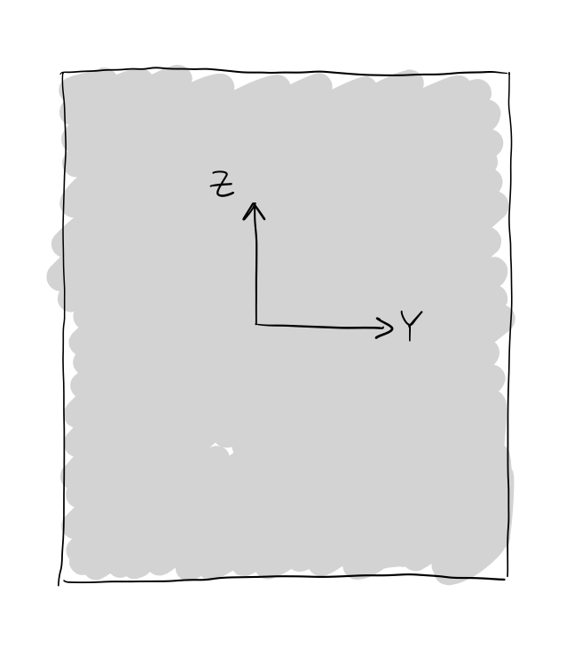
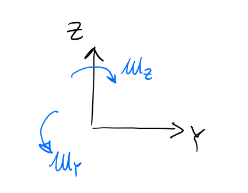
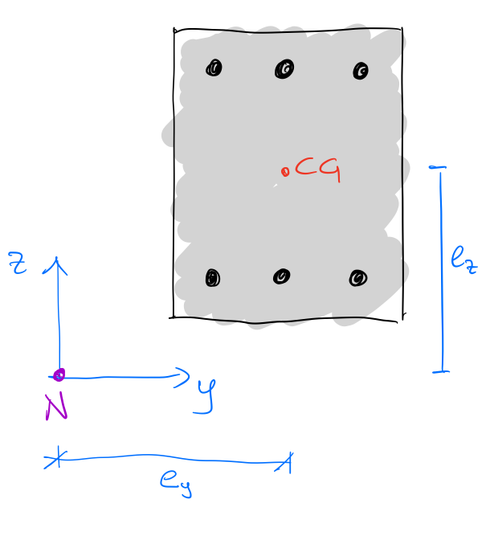

# Coordinate system and sign convention

Structuralcodes adopts a coordinate system **GRS** with the following conventions:

- **X-axis**: Points out of the screen (toward the observer).
- **Y-axis**: Points to the right on the screen.
- **Z-axis**: Points upward on the screen.

Note that this coordinate system is consistent with graphical representations, where Shapely operates in screen coordinates (XY), mapped to **GRS** coordinates as **yz**.

### Sign conventions
1. **Forces** are negative when in compression.
2. **Moments** follow the right-hand rule:
   - **My** (bending about the Y-axis) is positive when top fibers are stretched, and bottom fibers are compressed.
   - **Mz** (bending about the Z-axis) is positive when left fibers are stretched, and right fibers are compressed.
3. **Stresses** and **strains** are positive in tension and negative in compression.
4. **Loads** are acting in the origin of the GRS.

:::{Caution}
Pay **particular attention to point 4**: when the section is subjected to axial load, this is considered acting on (0, 0), therefore, respect to the center of gravity of the section, there are some offset moments that are generated. If you want the load to act on the center of the section, translate the geometry in order to have the center in (0, 0)

:::