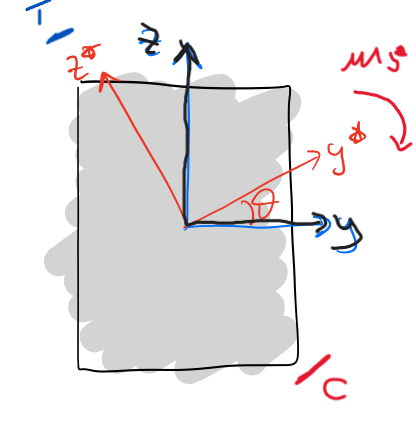
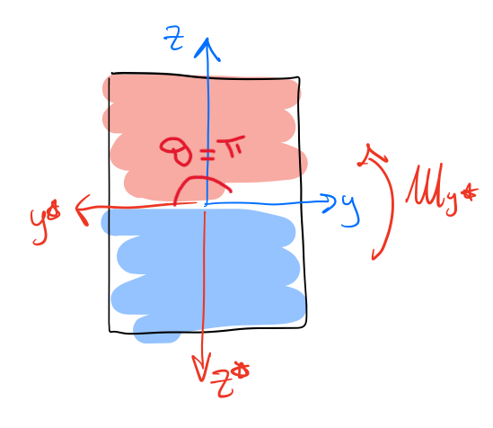
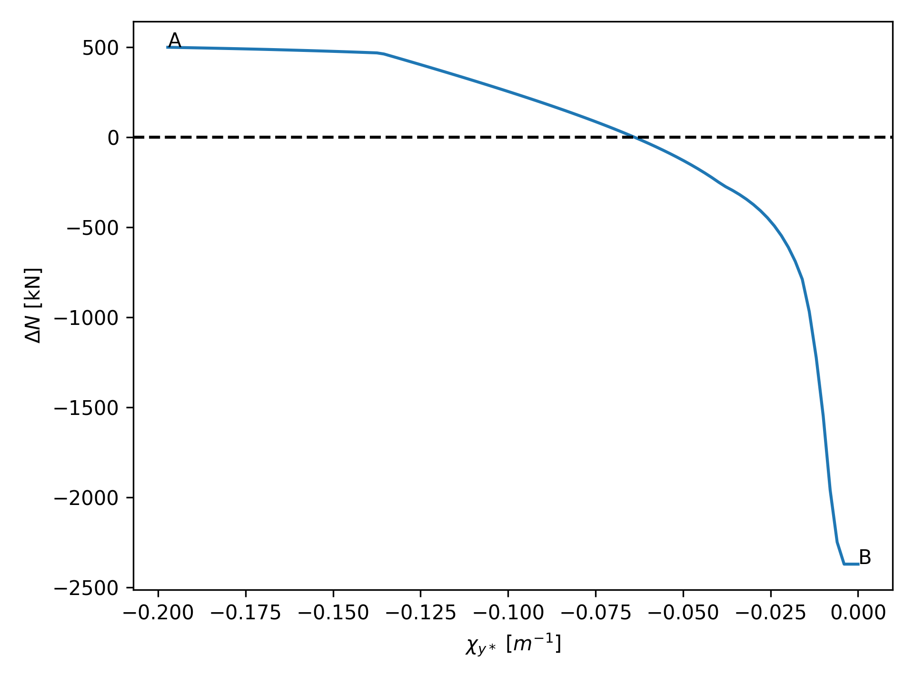
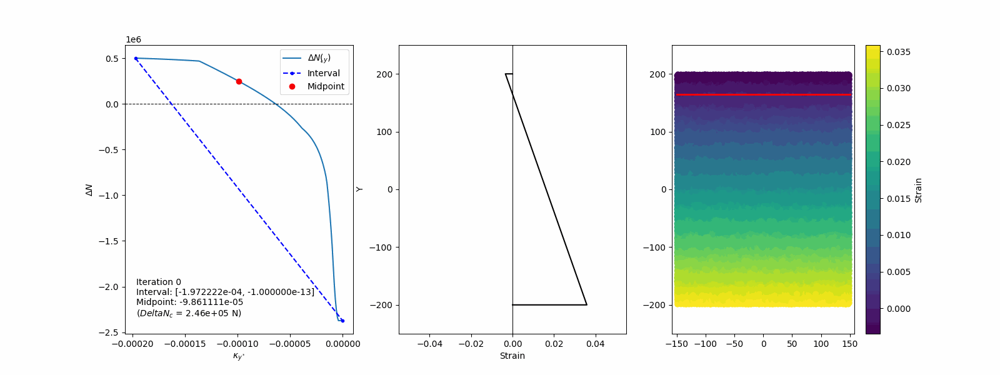

# Section

## General

## Coordinate system and sign convention

Structuralcodes adopts a coordinate system **GRS** with the following conventions:

- **X-axis**: Points out of the screen (toward the observer).
- **Y-axis**: Points to the right on the screen.
- **Z-axis**: Points upward on the screen.

Note that this coordinate system is consistent with graphical representations, where Shapely operates in screen coordinates (XY), mapped to **GRS** coordinates as **yz**.

### Sign conventions
1. **Forces** are negative when in compression.
2. **Moments** follow the right-hand rule:
   - **My** (bending about the Y-axis) is positive when top fibers are stretched, and bottom fibers are compressed.
   - **Mz** (bending about the Z-axis) is positive when left fibers are stretched, and right fibers are compressed.
3. **Stresses** and **strains** are positive in tension and negative in compression.
4. **Loads** are acting in the origin of the GRS.

:::{Important}
Pay **particular attention to point 4**: when the section is subjected to axial load, this is considered acting on (0, 0), therefore, respect to the center of gravity of the section, there are some offset moments that are generated. If you want the load to act on the center of the section, translate the geometry in order to have the center in (0, 0)

:::

## Geometry definition

Structuralcodes adopts Shapely for creating and managing the geometry. Shapely works in screen **XY** coordinates, which are mapped to **yz** in the **GRS** system. Geometries are essential for defining structural sections and are categorized into the following classes:

### PointGeometry
Defines individual points in the plane. These typically represents reinforcing bars. A point geometry is represented by its coordinates combined with a material.

### SurfaceGeometry
Represents simple surface-based geometries such as rectangles, circles or generic polygons, also with holes. A surface geometry is represented as a shapely polygon combined with a material.

### CompoundGeometry
Combines multiple geometries into a single entity. Allows the creation of complex sections by grouping simpler geometries. A typical use is combining one or more surface geometries

:::{seealso}
For a description of the API for geometry creation and the different classes involved, refer to the [API documentation](https://fib-international.github.io/structuralcodes/api/index.html#).
:::

**Figure Placeholder**: Example of geometries (SurfaceGeometry, PointGeometry, and CompoundGeometry) and their translations to the GRS coordinate system.

## Section calculators
Section calculators evaluate the structural response based on section properties and applied loads. They integrate results from the geometry and material models to provide insights into section performance by using a specific *section integrator*.

### General concept
The section calculator contains the methods that permits to handle a structual analysis for a cross section. For instance it is possible to compute the bending strength given the axial force, or to compute the moment curvatura, or to compute the strength domain. The outputs of those methods are represented as *ad-hoc* defined results objects which contains the data and the methods to further process them.

:::{Important}
Note that in the current implementation both material constitutive laws and section are *unitless*. It means that user should choose a consistent set of units, like N for forces and mm for lengths; in this way the stresses will be in MPa and the moments in Nmm.
Pay attention that default-defined constitutive laws by material classes work with the units defined by the considered code, e.g. MPa for EC2 or MC2010.
:::

### Compute bending strength
With this algorithm, *structuralcodes* computes the bending strength of the section given the axial load (positive in tension and negative in compression) and an angle of the neutral axes respect to the y axis. 

In the rotated reference system **y\*z\***, the bending strength in terms of positive $M_y^*$ is computed.

:::{Note}
According to such definition, to compute the bending strength for a section with top fibers in compression and bottom fibers in tension, the angle theta should be inpu equal to *pi*.

:::

According to classic RC theory, the deformations domains could be represented as following (with domains from 1 to 6 moving respectivelly from pure tension to pure compression):

The algorithm developed can be summarized as follows:
1. **Rotate the section**: the section is rotated by the given angle theta. In this new CRS (**y\*z\***), the problem becomes uniaxial bending about the **y\*** axis
2. **Axial load check**: verify if axial load is within the admissible range of axial loads (in tension and compression). This ensures the section can withstand the applied aixal load without failure.
3. **Ultimate strain profile**: find a strain profile that reaches the utimate strain for at least one of the materials. The found strain profile must guarantee equilibrium with external axial load. This is computed with an iterative algorithm based on bisection method.
    1. The internal axial load, defined by the balanced failure condition (i.e., the simultaneous reaching of ultimate strain in both the stretched and compressed materials), is evaluated by integrating the strain profile.
    2. If the internal axial load is greater than the external axial load, the neutral axis needs to be lowered, indicating excessive tension in the section. If the internal axial load is lower, the neutral axis should be raised to reduce compression.
    3. The strain profile is then adjusted by changing the curvature, pivoting on either the top or bottom chord. The goal is to balance the axial load and reach a solution that satisfies equilibrium. This is done solving the equation $\Delta N(k_{y^*}) = 0$ where $\Delta N(k_{y^*}) = N_ext - N_int(k_{y^*})$. For instance the function could be something like depicted in the following picture:

    

    Bisection algorithm permits to find the zero of the function in some iterations.

    

4. **Final Computation of Bending Strength**: once the equilibrium strain profile is found, the bending strength is calculated. The bending moment is computed using the rotated section's stress-strain relationship, incorporating the material properties and geometry of the section. This results in the final bending strength in the rotated coordinate system, which is then transformed back to the original coordinate system.

## Section integrators
### General concept
Section integrators compute properties such as stiffness, stress distribution, or strain compatibility over a section. They operate on the geometry and material definitions to derive these results.

### Marin integrator
Handles sections with predefined shapes and material properties, ideal for standard geometries. It applies assumptions about material distribution to simplify calculations.

### Fiber integrator
Uses a discretized approach where the section is divided into fibers, each representing a material point. This method is highly versatile and suited for nonlinear analyses.

**Figure Placeholder**: Schematic comparison of Marin integrator and Fiber integrator approaches.
